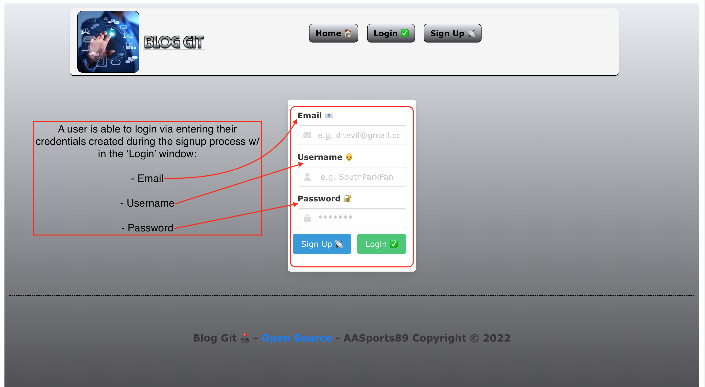
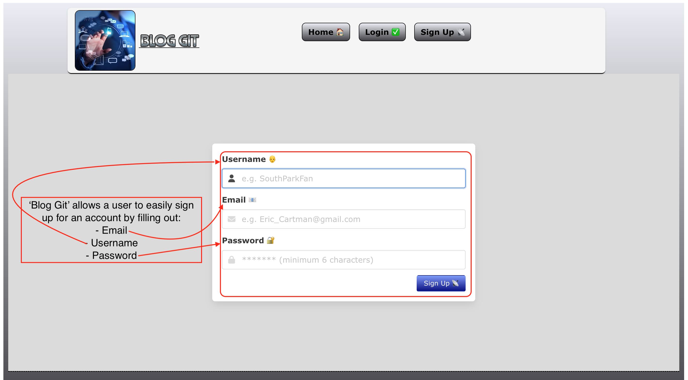
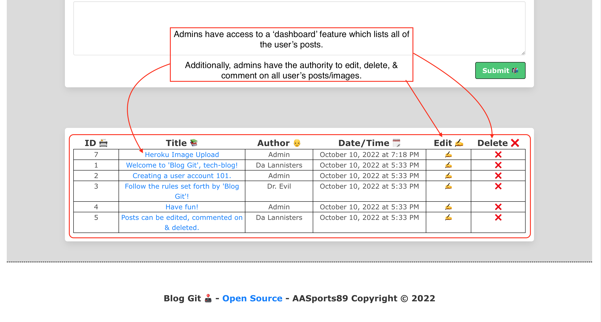
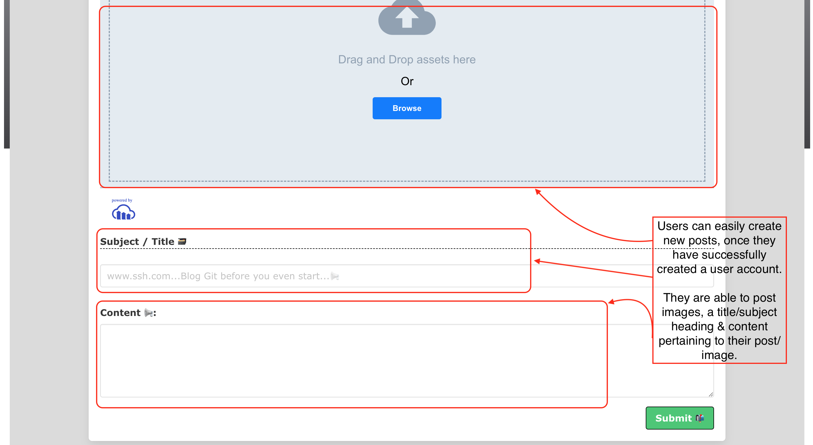
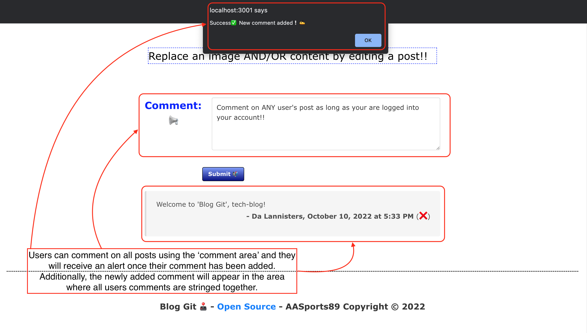
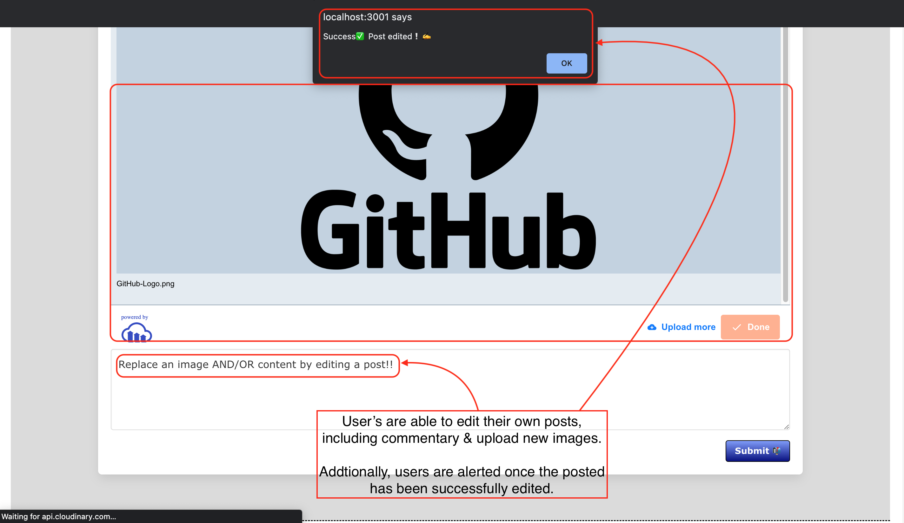
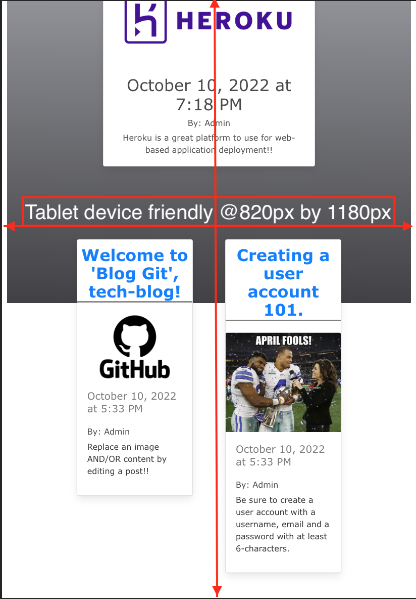
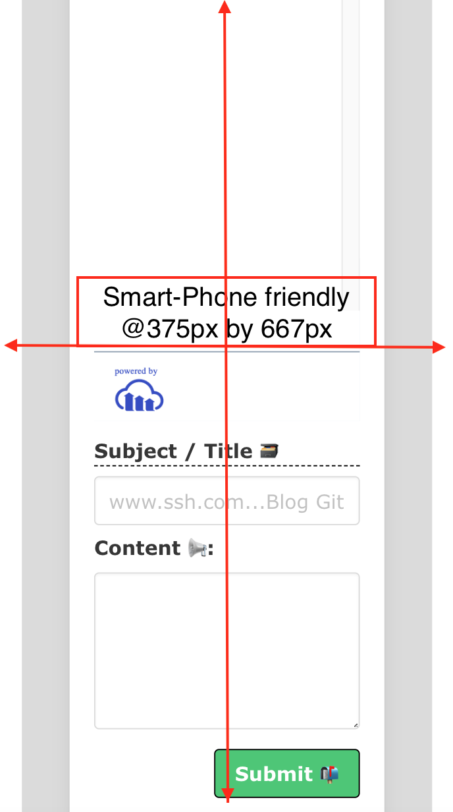

# **Blog Git** [](#isc-license)
---
  
## Overview
---
  **'Blog Git'** is a CMS-style blog site similar to a Wordpress site, where developers can publish their blog posts and comment on other developers’ posts as well. The application will feature ```API``` calls for the ```GET```, ```PUT```, ```POST``` and ```DELETE``` methods. 
  This application was designed based on the ```MVC``` concept, specifically utilizing the dynamic ```JavaScript``` and  ```HTML``` languages with dependencies on ```MySQL```, ```Express.js```, ```Handlebars```, ```Dotenv```, ```Bcrypt``` & ```Sequelize```.

  **'Blog Git'** features a functionality for a user to enter, comment-on, update and delete blog posts along with images. Additionally, the application will allow administrators to access a dashboard feature displaying all of user's blog post identifying data. Lastly, a user can gain access to all of the features w/in **'Blog Git'** by creating an account via ```login-in``` information securely stored using ```cookie``` & ```HTTP``` related processes which are all ran through ```Heroku```, the deployed application's location. 

## Table of Contents
---

  * [Overview](#overview)
  * [User Story](#user-story)
  * [Acceptance Criteria](#acceptance-criteria)
  * [Installation](#installation)
  * [Mock Up](#mock-up)
  * [Deployed Webpage URL](#deployed-webpage-url)
  * [GitHUB Repository](#github-repository)
  * [Evaluation Guideline](#evaluation-guideline)
  * [Contact Info](#contact-info)
  * [License](#isc-license)
  
## User Story
---
```md
AS A developer who writes about tech
I WANT a CMS-style blog site
SO THAT I can publish articles, blog posts, and my thoughts and opinions
```

## Acceptance Criteria
---
> **Note:** The following criteria is used to determine if the standards set for **'Blog Git'** have been met:

```md
GIVEN a CMS-style blog site
WHEN I visit the site for the first time
THEN I am presented with the homepage, which includes existing blog posts if any have been posted; navigation links for the homepage and the dashboard; and the option to log in
WHEN I click on the homepage option
THEN I am taken to the homepage
WHEN I click on any other links in the navigation
THEN I am prompted to either sign up or sign in
WHEN I choose to sign up
THEN I am prompted to create a username and password
WHEN I click on the sign-up button
THEN my user credentials are saved and I am logged into the site
WHEN I revisit the site at a later time and choose to sign in
THEN I am prompted to enter my username and password
WHEN I am signed in to the site
THEN I see navigation links for the homepage, the dashboard, and the option to log out
WHEN I click on the homepage option in the navigation
THEN I am taken to the homepage and presented with existing blog posts that include the post title and the date created
WHEN I click on an existing blog post
THEN I am presented with the post title, contents, post creator’s username, and date created for that post and have the option to leave a comment
WHEN I enter a comment and click on the submit button while signed in
THEN the comment is saved and the post is updated to display the comment, the comment creator’s username, and the date created
WHEN I click on the dashboard option in the navigation
THEN I am taken to the dashboard and presented with any blog posts I have already created and the option to add a new blog post
WHEN I click on the button to add a new blog post
THEN I am prompted to enter both a title and contents for my blog post
WHEN I click on the button to create a new blog post
THEN the title and contents of my post are saved and I am taken back to an updated dashboard with my new blog post
WHEN I click on one of my existing posts in the dashboard
THEN I am able to delete or update my post and taken back to an updated dashboard
WHEN I click on the logout option in the navigation
THEN I am signed out of the site
WHEN I am idle on the site for more than a set time
THEN I am able to view comments but I am prompted to log in again before I can add, update, or delete comments
```
## Installation
---
> **Important:** Once, the source code has been cloned from the repository @https://github.com/AASports89/blog-git:

 Enter the following to initiate the app configuration & installation process:

 ```
 npm i express
 ```
 -followed by-
 ```
 npm i express-handlebars
 ```
 -followed by-
 ```
 npm i mysql2
 ```
 -followed by-
 ```
 npm i dotenv
 ```
 -followed by-
 ```
 npm i sequelize
 ```
 -followed by-
 ```
 node seed/index.js
 ```
 -followed by-
 ```
 node server.js
 ```
 in the terminal cmd to install & run locally via PORT 3001.

## Mock-Up
---
> **Note:** The following GIF & images show **'Blog Git'** appearance and functionality:

### **Overall App:** (*GIF*)


### **Homepage:**
---


### **Login Page:**
---


### **Sign Up Page:**
---


### **Admin Dashboard:**
---


### **Create Post:**
---


### **Comment on Post:**
---


### **Edit Post:**
---


### **Tablet Device Capable:**
---


### **Smart Phone Capable:**
---


## Deployed Webpage URL
---
> https://shrouded-temple-26204.herokuapp.com/

## GitHUB Repository
---
> https://github.com/AASports89/blog-git

## Evaluation Guideline
---
> **Note**: The following evaluation guideline is used to determine if **'Blog Git'** meets the requirements for a minimum viable product:

### Technical Acceptance Criteria: 40%

* Satisfies all of the preceding acceptance criteria plus the following:

    * Application’s folder structure follows the Model-View-Controller paradigm.

    * Uses the [express-handlebars](https://www.npmjs.com/package/express-handlebars) package to implement Handlebars.js for your Views.

    * Application must be deployed to Heroku.

### Deployment: 32%

* Application deployed at live URL.

* Application loads with no errors.

* Application GitHub URL submitted.

* GitHub repository contains application code.

### Application Quality: 15%

* User experience is intuitive and easy to navigate.

* User interface style is clean and polished.

* Application resembles the mock-up functionality provided in the Challenge instructions.

### Repository Quality: 13%

* Repository has a unique name.

* Repository follows best practices for file structure and naming conventions.

* Repository follows best practices for class/id naming conventions, indentation, quality comments, etc.

* Repository contains multiple descriptive commit messages.

* Repository contains quality readme file with description, screenshot, and link to deployed application.

## Contact Info
---
> **Note:** Any Questions? 
> * Please visit my deployed application webpage  @https://
> * Additionally, you can view the source code for this project and others @https://github.com/AASports89/

## **ISC License**
---
**Copyright © 2022 - AASports89** 🎲

Permission to use, copy, modify, and/or distribute this software for any purpose with or without fee is hereby granted, provided that the above copyright notice and this permission notice appear in all copies.

THE SOFTWARE IS PROVIDED "AS IS" AND THE AUTHOR DISCLAIMS ALL WARRANTIES WITH REGARD TO THIS SOFTWARE INCLUDING ALL IMPLIED WARRANTIES OF MERCHANTABILITY AND FITNESS. IN NO EVENT SHALL THE AUTHOR BE LIABLE FOR ANY SPECIAL, DIRECT, INDIRECT, OR CONSEQUENTIAL DAMAGES OR ANY DAMAGES WHATSOEVER RESULTING FROM LOSS OF USE, DATA OR PROFITS, WHETHER IN AN ACTION OF CONTRACT, NEGLIGENCE OR OTHER TORTIOUS ACTION, ARISING OUT OF OR IN CONNECTION WITH THE USE OR PERFORMANCE OF THIS SOFTWARE.

---
---
